**1 Lab tasks**</br>
**1.1 K-means: Clustering some synthetic data**

1. Download from the course site the 2D data stored in data kmeans.txt file.


```python
import pandas as pd
import numpy as np
import matplotlib.pyplot as plt
import random
from mpl_toolkits.mplot3d import Axes3D
```


```python
# uploading file in Google Colab
from google.colab import files
uploaded = files.upload()
```


<input type="file" id="files-8bdb2588-8a28-4fce-8dda-65b4bc8c5a5d" name="files[]" multiple disabled
   style="border:none" />
<output id="result-8bdb2588-8a28-4fce-8dda-65b4bc8c5a5d">
 Upload widget is only available when the cell has been executed in the
 current browser session. Please rerun this cell to enable.
 </output>
 <script src="/nbextensions/google.colab/files.js"></script> 


    Saving data_kmeans.txt to data_kmeans (1).txt


```python
# reading file in Google Colab
import io
data = pd.read_csv(io.BytesIO(uploaded['data_kmeans.txt']), delimiter =  " ", header=None)
```


```python
# reading file in JupyterLab
data = pd.read_csv('data/kmeans/data_kmeans.txt', delimiter =  " ", header=None)
```


```python
data.head()
```


<div>
<style scoped>
    .dataframe tbody tr th:only-of-type {
        vertical-align: middle;
    }

    .dataframe tbody tr th {
        vertical-align: top;
    }

    .dataframe thead th {
        text-align: right;
    }
</style>
<table border="1" class="dataframe">
  <thead>
    <tr style="text-align: right;">
      <th></th>
      <th>0</th>
      <th>1</th>
    </tr>
  </thead>
  <tbody>
    <tr>
      <th>0</th>
      <td>1.8421</td>
      <td>4.6076</td>
    </tr>
    <tr>
      <th>1</th>
      <td>5.6586</td>
      <td>4.8000</td>
    </tr>
    <tr>
      <th>2</th>
      <td>6.3526</td>
      <td>3.2909</td>
    </tr>
    <tr>
      <th>3</th>
      <td>2.9040</td>
      <td>4.6122</td>
    </tr>
    <tr>
      <th>4</th>
      <td>3.2320</td>
      <td>4.9399</td>
    </tr>
  </tbody>
</table>
</div>


```python
data.describe()
```


<div>
<style scoped>
    .dataframe tbody tr th:only-of-type {
        vertical-align: middle;
    }

    .dataframe tbody tr th {
        vertical-align: top;
    }

    .dataframe thead th {
        text-align: right;
    }
</style>
<table border="1" class="dataframe">
  <thead>
    <tr style="text-align: right;">
      <th></th>
      <th>0</th>
      <th>1</th>
    </tr>
  </thead>
  <tbody>
    <tr>
      <th>count</th>
      <td>300.000000</td>
      <td>300.000000</td>
    </tr>
    <tr>
      <th>mean</th>
      <td>3.684376</td>
      <td>2.987101</td>
    </tr>
    <tr>
      <th>std</th>
      <td>1.925578</td>
      <td>1.685079</td>
    </tr>
    <tr>
      <th>min</th>
      <td>-0.245130</td>
      <td>0.205810</td>
    </tr>
    <tr>
      <th>25%</th>
      <td>2.156175</td>
      <td>1.210775</td>
    </tr>
    <tr>
      <th>50%</th>
      <td>3.231550</td>
      <td>2.949750</td>
    </tr>
    <tr>
      <th>75%</th>
      <td>5.509525</td>
      <td>4.807775</td>
    </tr>
    <tr>
      <th>max</th>
      <td>8.203400</td>
      <td>5.784300</td>
    </tr>
  </tbody>
</table>
</div>


```python
data.plot(x=data.columns[0], y=data.columns[1], kind="scatter")
```


    <matplotlib.axes._subplots.AxesSubplot at 0x7fd5d2c3e9d0>


    
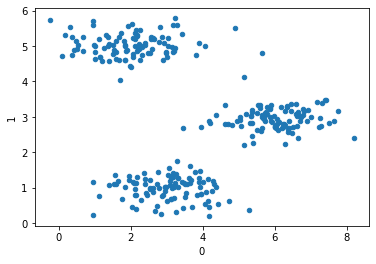
    


2. Cluster them using the K-means algorithm using the formulas seen in class.


```python
K = 3
X = np.array(data)
```


```python
init_centroids = random.sample(range(0, len(data)), K)
```


```python
centroids = []
for i in init_centroids:
    centroids.append(data.loc[i])
centroids = np.array(centroids)
centroids
```


    array([[2.4558 , 0.78905],
           [5.132  , 2.1981 ],
           [2.0236 , 0.44772]])


```python
def calc_distance(X1, X2):
    return(sum((X1 - X2)**2))**0.5
```


```python
def findClosestCentroids(uk, X):
    assigned_centroid = []
    for i in X:
        distance=[]
        for j in uk:
            distance.append(calc_distance(i, j))
        assigned_centroid.append(np.argmin(distance))
    return assigned_centroid
```


```python
def calc_centroids(clusters, X):
    new_centroids = []
    new_df = pd.concat([pd.DataFrame(X), pd.DataFrame(clusters, columns=['cluster'])],
                      axis=1)
    for c in set(new_df['cluster']):
        current_cluster = new_df[new_df['cluster'] == c][new_df.columns[:-1]]
        cluster_mean = current_cluster.mean(axis=0)
        new_centroids.append(cluster_mean)
    return new_centroids
```


```python
get_centroids = findClosestCentroids(centroids, X)
```


```python
for i in range(10):

    # finding the closest centroid for each data point
    get_centroids = findClosestCentroids(centroids, X)
    # adjusting centroids
    centroids = calc_centroids(get_centroids, X)

    # plotting each iteration
    plt.figure()
    plt.scatter(np.array(centroids)[:, 0], np.array(centroids)[:, 1], color='black')
    plt.scatter(X[:, 0], X[:, 1], alpha=0.1)
    plt.show()
```


    
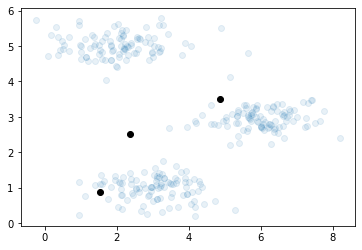
    


    
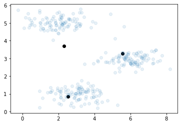
    


    
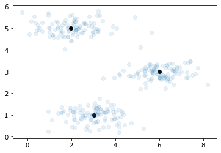
    


    

    


    

    


    

    


    

    


    

    


    

    


    

    


3. Test your model with some new data.


```python
x_test = np.random.uniform(low=0.0, high=8.2, size = (1000,2))
get_centroids = findClosestCentroids(centroids, x_test)
```

4. Plot both training and test results in a 2D graph.


```python
plt.figure()
plt.scatter(np.array(centroids)[:, 0], np.array(centroids)[:, 1], color="black")
plt.scatter(X[:, 0], X[:, 1], alpha=0.75)

for index, x in enumerate(x_test):

    if (get_centroids[index] == 0):
        plt.scatter(x_test[index , 0], x_test[index, 1], alpha=0.1, color="red")
    if (get_centroids[index] == 1):
        plt.scatter(x_test[index, 0], x_test[index, 1], alpha=0.1, color="blue")
    if (get_centroids[index] == 2):
        plt.scatter(x_test[index, 0], x_test[index, 1], alpha=0.1, color="green")

plt.show()
```


    
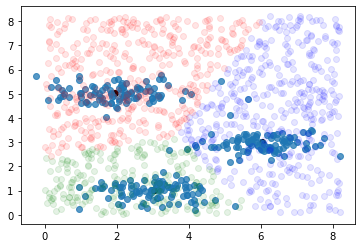
    


 **2 Homework tasks</br> 
 2.1 K-means:Clustering some real data**

1. Using the given dataset, cluster the students in 3 clusters (weak, average and gifted clusters) using the K-means algorithm.


```python
# uploading file in Google Colab
uploaded = files.upload()
```


<input type="file" id="files-b9f552d3-5344-46f5-be49-867412d57177" name="files[]" multiple disabled
   style="border:none" />
<output id="result-b9f552d3-5344-46f5-be49-867412d57177">
 Upload widget is only available when the cell has been executed in the
 current browser session. Please rerun this cell to enable.
 </output>
 <script src="/nbextensions/google.colab/files.js"></script> 


    Saving grade_students.csv to grade_students (1).csv


```python
# reading file in Google Colab
data_gradeStd = pd.read_csv(io.BytesIO(uploaded['grade_students.csv']))
```


```python
# reading file in JupyterLab
data_gradeStd = pd.read_csv('data/kmeans/grade_students.csv')
```


```python
data_gradeStd.head()
```


<div>
<style scoped>
    .dataframe tbody tr th:only-of-type {
        vertical-align: middle;
    }

    .dataframe tbody tr th {
        vertical-align: top;
    }

    .dataframe thead th {
        text-align: right;
    }
</style>
<table border="1" class="dataframe">
  <thead>
    <tr style="text-align: right;">
      <th></th>
      <th>g1freelunch</th>
      <th>g1absent</th>
      <th>g1readscore</th>
      <th>g1mathscore</th>
      <th>g1listeningscore</th>
      <th>g1wordscore</th>
    </tr>
  </thead>
  <tbody>
    <tr>
      <th>0</th>
      <td>1</td>
      <td>9</td>
      <td>516</td>
      <td>578</td>
      <td>601</td>
      <td>493</td>
    </tr>
    <tr>
      <th>1</th>
      <td>0</td>
      <td>12</td>
      <td>451</td>
      <td>507</td>
      <td>584</td>
      <td>436</td>
    </tr>
    <tr>
      <th>2</th>
      <td>1</td>
      <td>4</td>
      <td>483</td>
      <td>526</td>
      <td>529</td>
      <td>486</td>
    </tr>
    <tr>
      <th>3</th>
      <td>1</td>
      <td>15</td>
      <td>516</td>
      <td>505</td>
      <td>556</td>
      <td>536</td>
    </tr>
    <tr>
      <th>4</th>
      <td>1</td>
      <td>2</td>
      <td>433</td>
      <td>463</td>
      <td>504</td>
      <td>426</td>
    </tr>
  </tbody>
</table>
</div>


```python
data_gradeStd.describe()
```


<div>
<style scoped>
    .dataframe tbody tr th:only-of-type {
        vertical-align: middle;
    }

    .dataframe tbody tr th {
        vertical-align: top;
    }

    .dataframe thead th {
        text-align: right;
    }
</style>
<table border="1" class="dataframe">
  <thead>
    <tr style="text-align: right;">
      <th></th>
      <th>g1freelunch</th>
      <th>g1absent</th>
      <th>g1readscore</th>
      <th>g1mathscore</th>
      <th>g1listeningscore</th>
      <th>g1wordscore</th>
    </tr>
  </thead>
  <tbody>
    <tr>
      <th>count</th>
      <td>5550.000000</td>
      <td>5550.000000</td>
      <td>5550.000000</td>
      <td>5550.000000</td>
      <td>5550.000000</td>
      <td>5550.000000</td>
    </tr>
    <tr>
      <th>mean</th>
      <td>0.500901</td>
      <td>7.421261</td>
      <td>521.307207</td>
      <td>531.456216</td>
      <td>567.824324</td>
      <td>514.643063</td>
    </tr>
    <tr>
      <th>std</th>
      <td>0.500044</td>
      <td>7.004582</td>
      <td>55.278448</td>
      <td>43.151113</td>
      <td>33.562973</td>
      <td>52.858396</td>
    </tr>
    <tr>
      <th>min</th>
      <td>0.000000</td>
      <td>0.000000</td>
      <td>404.000000</td>
      <td>404.000000</td>
      <td>477.000000</td>
      <td>317.000000</td>
    </tr>
    <tr>
      <th>25%</th>
      <td>0.000000</td>
      <td>2.000000</td>
      <td>478.000000</td>
      <td>502.000000</td>
      <td>543.000000</td>
      <td>475.000000</td>
    </tr>
    <tr>
      <th>50%</th>
      <td>1.000000</td>
      <td>6.000000</td>
      <td>516.000000</td>
      <td>529.000000</td>
      <td>565.000000</td>
      <td>514.000000</td>
    </tr>
    <tr>
      <th>75%</th>
      <td>1.000000</td>
      <td>10.000000</td>
      <td>558.000000</td>
      <td>562.000000</td>
      <td>588.000000</td>
      <td>551.000000</td>
    </tr>
    <tr>
      <th>max</th>
      <td>1.000000</td>
      <td>84.000000</td>
      <td>651.000000</td>
      <td>676.000000</td>
      <td>708.000000</td>
      <td>601.000000</td>
    </tr>
  </tbody>
</table>
</div>


```python
K = 3
X = np.array(data_gradeStd)

init_centroids = random.sample(range(0, len(data_gradeStd)), K)
centroids = []
for i in init_centroids:
    centroids.append(data_gradeStd.loc[i])
centroids = np.array(centroids)
centroids
```


    array([[  1,   6, 492, 520, 541, 499],
           [  0,  28, 516, 520, 571, 506],
           [  1,   5, 651, 584, 577, 601]])


```python
get_centroids = findClosestCentroids(centroids, X)
```


```python
for i in range(10):

    # finding the closest centroid for each data point
    get_centroids = findClosestCentroids(centroids, X)
    # adjusting centroids
    centroids = calc_centroids(get_centroids, X)
```

2. Interpret your results. That is, relate the input-feature values to the output values and comment your observations.


```python
res = np.concatenate((X, np.array(get_centroids)[:,None]),axis=1)
```


```python
y = [res[res[:,6] == k] for k in np.unique(res[:,6])]
```


```python
means0 = np.zeros(6)
means1 = np.zeros(6)
means2 = np.zeros(6)

for i in range(6):
    means0[i] = np.mean((y[0])[:,i], axis=0)
    means1[i] = np.mean((y[1])[:,i], axis=0)
    means2[i] = np.mean((y[2])[:,i], axis=0)
```


```python
print("===freelunch===")
print("cluster 0:", means0[0])
print("cluster 1:", means1[0])
print("cluster 2:", means2[0])
print('\n')
print("===absentism===")
print("cluster 0:", means0[1])
print("cluster 1:", means1[1])
print("cluster 2:", means2[1])
print('\n')

labels = ['g1readscore', 'g1mathscore', 'g1listeningscore', "g1wordscore"]

x = np.arange(len(labels))  # the label locations
width = 0.2  # the width of the bars

fig, ax = plt.subplots()
rects1 = ax.bar(x - width, means0[2:6], width, label='c0')
rects2 = ax.bar(x, means1[2:6], width, label='c1')
rects3 = ax.bar(x + width, means2[2:6], width, label='c2')

# Add some text for labels, title and custom x-axis tick labels, etc.
ax.set_ylabel('Scores')
ax.set_title('Scores by cluster')
ax.set_xticks(x)
ax.set_xticklabels(labels)
ax.legend()

fig.tight_layout()

plt.show()
```

    ===freelunch===
    cluster 0: 0.7258748674443266
    cluster 1: 0.46465968586387435
    cluster 2: 0.2521865889212828
    
    
    ===absentism===
    cluster 0: 8.635206786850476
    cluster 1: 6.93368237347295
    cluster 2: 6.567055393586005
    
    


    
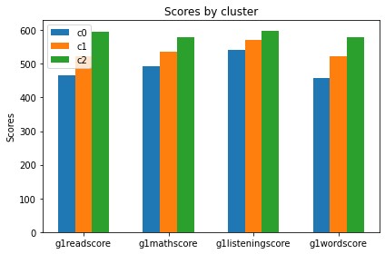
    


We identified the cluster 0 as the weak students. They benefit the most from free lunchs, they are the most often absent to class and their results are the lowest.

We identified the cluster 1 as the average students. They benefit of some free lunchs, they are sometimes absent to class and their results are average.

We identified the cluster 2 as the gifted students. They benefit the less from free lunchs, they are the less often absent to class and their results are the best.

**2.2 PCA: Reducing the dimension of some synthetic data**
1. Download from the course site the 2D data stored in data pca.txt file.


```python
# uploading file in Google Colab
uploaded = files.upload()
```


<input type="file" id="files-45dc45a7-5eeb-4463-9a0a-6014e43255f1" name="files[]" multiple disabled
   style="border:none" />
<output id="result-45dc45a7-5eeb-4463-9a0a-6014e43255f1">
 Upload widget is only available when the cell has been executed in the
 current browser session. Please rerun this cell to enable.
 </output>
 <script src="/nbextensions/google.colab/files.js"></script> 


    Saving data_pca.txt to data_pca (1).txt


```python
# reading file in Google Colab
data_pca = pd.read_csv(io.BytesIO(uploaded['data_pca.txt']), delimiter =  " ", header=None)
```


```python
# reading file in JupyterLab
data_pca = pd.read_csv('data/pca/data_pca.txt', delimiter =  " ", header=None)
```


```python
data_pca.head()
```


<div>
<style scoped>
    .dataframe tbody tr th:only-of-type {
        vertical-align: middle;
    }

    .dataframe tbody tr th {
        vertical-align: top;
    }

    .dataframe thead th {
        text-align: right;
    }
</style>
<table border="1" class="dataframe">
  <thead>
    <tr style="text-align: right;">
      <th></th>
      <th>0</th>
      <th>1</th>
    </tr>
  </thead>
  <tbody>
    <tr>
      <th>0</th>
      <td>3.3816</td>
      <td>3.3891</td>
    </tr>
    <tr>
      <th>1</th>
      <td>4.5279</td>
      <td>5.8542</td>
    </tr>
    <tr>
      <th>2</th>
      <td>2.6557</td>
      <td>4.4120</td>
    </tr>
    <tr>
      <th>3</th>
      <td>2.7652</td>
      <td>3.7154</td>
    </tr>
    <tr>
      <th>4</th>
      <td>2.8466</td>
      <td>4.1755</td>
    </tr>
  </tbody>
</table>
</div>


```python
data_pca.describe()
```


<div>
<style scoped>
    .dataframe tbody tr th:only-of-type {
        vertical-align: middle;
    }

    .dataframe tbody tr th {
        vertical-align: top;
    }

    .dataframe thead th {
        text-align: right;
    }
</style>
<table border="1" class="dataframe">
  <thead>
    <tr style="text-align: right;">
      <th></th>
      <th>0</th>
      <th>1</th>
    </tr>
  </thead>
  <tbody>
    <tr>
      <th>count</th>
      <td>50.000000</td>
      <td>50.000000</td>
    </tr>
    <tr>
      <th>mean</th>
      <td>3.989264</td>
      <td>5.002806</td>
    </tr>
    <tr>
      <th>std</th>
      <td>1.173058</td>
      <td>1.023412</td>
    </tr>
    <tr>
      <th>min</th>
      <td>1.180200</td>
      <td>2.878700</td>
    </tr>
    <tr>
      <th>25%</th>
      <td>3.051100</td>
      <td>4.418225</td>
    </tr>
    <tr>
      <th>50%</th>
      <td>3.963500</td>
      <td>5.012900</td>
    </tr>
    <tr>
      <th>75%</th>
      <td>4.891300</td>
      <td>5.810525</td>
    </tr>
    <tr>
      <th>max</th>
      <td>5.911300</td>
      <td>7.363200</td>
    </tr>
  </tbody>
</table>
</div>


2. Implement the PCA algorithm from the formulas seen in class.


```python
def PCA(X, P = 2):
    # Centering:
    # Step 1 & 2
    X_zero_mean = X - np.mean(X , axis = 0)

    # Step 3: covariance matrix of the mean-centered data.
    cov_mat = np.cov(X_zero_mean , rowvar = False)

    # Step 4: calculating Eigenvalues and Eigenvectors of the covariance matrix
    eigen_values , eigen_vectors = np.linalg.eigh(cov_mat)

    # sort index in descending order
    sorted_index = np.argsort(eigen_values)[::-1]
    # sort the eigenvalues
    sorted_eigenvalues = eigen_values[sorted_index]
    # sort the eigenvectors 
    sorted_eigenvectors = eigen_vectors[:,sorted_index]

    # selection of the principal component(s)
    eigenvectors_reduced = sorted_eigenvectors[:,0:P]

    # Step 5: Projection of X_zero_mean with eigenvectors 
    X_reduced = np.dot(eigenvectors_reduced.transpose(),X_zero_mean.transpose()).transpose()

    return X_zero_mean, eigenvectors_reduced, X_reduced, sorted_eigenvalues
```


```python
X = np.array(data_pca)
```


```python
# Consider the P most significant eigenvectors (dimension of our final reduced data)
P = 1
X_zero_mean, eigenvectors_reduced, _, _ = PCA(X,P)
```

3. Indicate the principal axes of the data.


```python
# Principle axes of the data (principal eigenvector represented in red)
plt.figure()
plt.scatter(X_zero_mean[:, 0], X_zero_mean[:, 1], color="blue", alpha=0.5)
plt.quiver(eigenvectors_reduced[0], eigenvectors_reduced[1], color='r', scale=3)
plt.show()
```


    
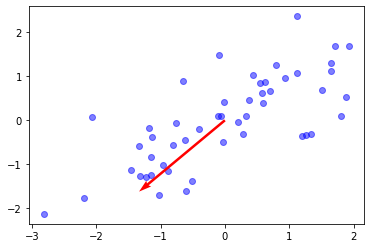
    


4. Test your model with some new data.


```python
X_test = np.random.normal(loc=[4.0, 5.0], scale=[1.5, 1.0], size = (100,2))
```


```python
X_test_zero_mean, test_eigenvectors_reduced, _, _ = PCA(X_test, P)
```


```python
# Principle axes of the data
plt.figure()
plt.scatter(X_test_zero_mean[:, 0], X_test_zero_mean[:, 1], color="green", alpha=0.5)
plt.quiver(test_eigenvectors_reduced[0], test_eigenvectors_reduced[1], color='magenta', scale=3)
plt.show()
```


    
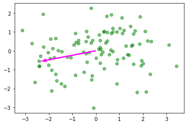
    


5. Plot both training and test results in a 2D graph.


```python
plt.figure()

plt.scatter(X_zero_mean[:, 0], X_zero_mean[:, 1], color="blue", alpha=0.4)
plt.quiver(eigenvectors_reduced[0], eigenvectors_reduced[1], color='r', scale=3)

plt.scatter(X_test_zero_mean[:, 0], X_test_zero_mean[:, 1], color="green", alpha=0.4)
plt.quiver(test_eigenvectors_reduced[0], test_eigenvectors_reduced[1], color='magenta', scale=3)

plt.show()
```


    
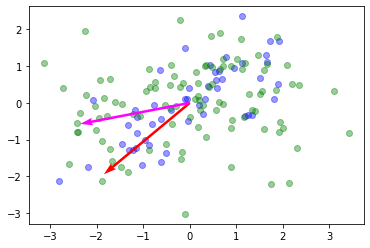
    


**2.3 PCA: Reducing the dimension of some real data**
1. Reduce the 8 dimensional data to a meaningful reduced dimensional space for both diabetic and non-diabetic groups separately.


```python
# uploading file in Google Colab
uploaded = files.upload()
```


<input type="file" id="files-1f090d0b-46a4-426c-ac68-6c8e023289dd" name="files[]" multiple disabled
   style="border:none" />
<output id="result-1f090d0b-46a4-426c-ac68-6c8e023289dd">
 Upload widget is only available when the cell has been executed in the
 current browser session. Please rerun this cell to enable.
 </output>
 <script src="/nbextensions/google.colab/files.js"></script> 


    Saving diabetes.csv to diabetes (3).csv


```python
# reading file in Google Colab
data_diabete = pd.read_csv(io.BytesIO(uploaded['diabetes.csv']))
```


```python
# reading file in JupyterLab
data_diabete = pd.read_csv('data/pca/diabetes.csv')
```


```python
data_diabete.head()
```


<div>
<style scoped>
    .dataframe tbody tr th:only-of-type {
        vertical-align: middle;
    }

    .dataframe tbody tr th {
        vertical-align: top;
    }

    .dataframe thead th {
        text-align: right;
    }
</style>
<table border="1" class="dataframe">
  <thead>
    <tr style="text-align: right;">
      <th></th>
      <th>Pregnancies</th>
      <th>Glucose</th>
      <th>BloodPressure</th>
      <th>SkinThickness</th>
      <th>Insulin</th>
      <th>BMI</th>
      <th>DiabetesPedigreeFunction</th>
      <th>Age</th>
      <th>Outcome</th>
    </tr>
  </thead>
  <tbody>
    <tr>
      <th>0</th>
      <td>6</td>
      <td>148</td>
      <td>72</td>
      <td>35</td>
      <td>0</td>
      <td>33.6</td>
      <td>0.627</td>
      <td>50</td>
      <td>1</td>
    </tr>
    <tr>
      <th>1</th>
      <td>1</td>
      <td>85</td>
      <td>66</td>
      <td>29</td>
      <td>0</td>
      <td>26.6</td>
      <td>0.351</td>
      <td>31</td>
      <td>0</td>
    </tr>
    <tr>
      <th>2</th>
      <td>8</td>
      <td>183</td>
      <td>64</td>
      <td>0</td>
      <td>0</td>
      <td>23.3</td>
      <td>0.672</td>
      <td>32</td>
      <td>1</td>
    </tr>
    <tr>
      <th>3</th>
      <td>1</td>
      <td>89</td>
      <td>66</td>
      <td>23</td>
      <td>94</td>
      <td>28.1</td>
      <td>0.167</td>
      <td>21</td>
      <td>0</td>
    </tr>
    <tr>
      <th>4</th>
      <td>0</td>
      <td>137</td>
      <td>40</td>
      <td>35</td>
      <td>168</td>
      <td>43.1</td>
      <td>2.288</td>
      <td>33</td>
      <td>1</td>
    </tr>
  </tbody>
</table>
</div>


```python
data_diabete.describe()
```


<div>
<style scoped>
    .dataframe tbody tr th:only-of-type {
        vertical-align: middle;
    }

    .dataframe tbody tr th {
        vertical-align: top;
    }

    .dataframe thead th {
        text-align: right;
    }
</style>
<table border="1" class="dataframe">
  <thead>
    <tr style="text-align: right;">
      <th></th>
      <th>Pregnancies</th>
      <th>Glucose</th>
      <th>BloodPressure</th>
      <th>SkinThickness</th>
      <th>Insulin</th>
      <th>BMI</th>
      <th>DiabetesPedigreeFunction</th>
      <th>Age</th>
      <th>Outcome</th>
    </tr>
  </thead>
  <tbody>
    <tr>
      <th>count</th>
      <td>768.000000</td>
      <td>768.000000</td>
      <td>768.000000</td>
      <td>768.000000</td>
      <td>768.000000</td>
      <td>768.000000</td>
      <td>768.000000</td>
      <td>768.000000</td>
      <td>768.000000</td>
    </tr>
    <tr>
      <th>mean</th>
      <td>3.845052</td>
      <td>120.894531</td>
      <td>69.105469</td>
      <td>20.536458</td>
      <td>79.799479</td>
      <td>31.992578</td>
      <td>0.471876</td>
      <td>33.240885</td>
      <td>0.348958</td>
    </tr>
    <tr>
      <th>std</th>
      <td>3.369578</td>
      <td>31.972618</td>
      <td>19.355807</td>
      <td>15.952218</td>
      <td>115.244002</td>
      <td>7.884160</td>
      <td>0.331329</td>
      <td>11.760232</td>
      <td>0.476951</td>
    </tr>
    <tr>
      <th>min</th>
      <td>0.000000</td>
      <td>0.000000</td>
      <td>0.000000</td>
      <td>0.000000</td>
      <td>0.000000</td>
      <td>0.000000</td>
      <td>0.078000</td>
      <td>21.000000</td>
      <td>0.000000</td>
    </tr>
    <tr>
      <th>25%</th>
      <td>1.000000</td>
      <td>99.000000</td>
      <td>62.000000</td>
      <td>0.000000</td>
      <td>0.000000</td>
      <td>27.300000</td>
      <td>0.243750</td>
      <td>24.000000</td>
      <td>0.000000</td>
    </tr>
    <tr>
      <th>50%</th>
      <td>3.000000</td>
      <td>117.000000</td>
      <td>72.000000</td>
      <td>23.000000</td>
      <td>30.500000</td>
      <td>32.000000</td>
      <td>0.372500</td>
      <td>29.000000</td>
      <td>0.000000</td>
    </tr>
    <tr>
      <th>75%</th>
      <td>6.000000</td>
      <td>140.250000</td>
      <td>80.000000</td>
      <td>32.000000</td>
      <td>127.250000</td>
      <td>36.600000</td>
      <td>0.626250</td>
      <td>41.000000</td>
      <td>1.000000</td>
    </tr>
    <tr>
      <th>max</th>
      <td>17.000000</td>
      <td>199.000000</td>
      <td>122.000000</td>
      <td>99.000000</td>
      <td>846.000000</td>
      <td>67.100000</td>
      <td>2.420000</td>
      <td>81.000000</td>
      <td>1.000000</td>
    </tr>
  </tbody>
</table>
</div>


```python
X_diabete = np.array(data_diabete)
```


```python
# splitting the array in two groups
X_diabete = [X_diabete[X_diabete[:,8] == k] for k in np.unique(X_diabete[:,8])]
```


```python
print("X_diabete[0]: non-diabetics")
print(X_diabete[0][0:3])
print("X_diabete[1]: diabetics")
print(X_diabete[1][0:3])
```

    X_diabete[0]: non-diabetics
    [[  1.     85.     66.     29.      0.     26.6     0.351  31.      0.   ]
     [  1.     89.     66.     23.     94.     28.1     0.167  21.      0.   ]
     [  5.    116.     74.      0.      0.     25.6     0.201  30.      0.   ]]
    X_diabete[1]: diabetics
    [[  6.    148.     72.     35.      0.     33.6     0.627  50.      1.   ]
     [  8.    183.     64.      0.      0.     23.3     0.672  32.      1.   ]
     [  0.    137.     40.     35.    168.     43.1     2.288  33.      1.   ]]


```python
# removing "Outcome" column as we already have groups
X_diabete[0] = np.delete(X_diabete[0], 8, 1)
X_diabete[1] = np.delete(X_diabete[1], 8, 1)
```


```python
print("X_diabete[0]: non-diabetics")
print(X_diabete[0][0:3])
print("X_diabete[1]: diabetics")
print(X_diabete[1][0:3])
```

    X_diabete[0]: non-diabetics
    [[  1.     85.     66.     29.      0.     26.6     0.351  31.   ]
     [  1.     89.     66.     23.     94.     28.1     0.167  21.   ]
     [  5.    116.     74.      0.      0.     25.6     0.201  30.   ]]
    X_diabete[1]: diabetics
    [[  6.    148.     72.     35.      0.     33.6     0.627  50.   ]
     [  8.    183.     64.      0.      0.     23.3     0.672  32.   ]
     [  0.    137.     40.     35.    168.     43.1     2.288  33.   ]]


```python
# Selecting Principal Components

# Group 0 (non-diabetics)
_, _, _, diabete0_sorted_eigenvalues = PCA(X_diabete[0])

# Group 1 (diabetics)
_, _, _, diabete1_sorted_eigenvalues = PCA(X_diabete[1])
```


```python
tot = sum(diabete0_sorted_eigenvalues)
var_exp = [(i / tot)*100 for i in diabete0_sorted_eigenvalues]
cum_var_exp = np.cumsum(var_exp)

with plt.style.context('seaborn-whitegrid'):
    plt.figure(figsize=(7, 5))
    plt.bar(range(8), var_exp, alpha=0.5, align='center', label='individual explained variance')
    plt.step(range(8), cum_var_exp, where='mid', label='cumulative explained variance')
    plt.title('Explained variance for non-diabetics')
    plt.ylabel('Explained variance ratio')
    plt.xlabel('Principal components')
    plt.legend(loc='best')
    plt.tight_layout()

tot = sum(diabete1_sorted_eigenvalues)
var_exp = [(i / tot)*100 for i in diabete1_sorted_eigenvalues]
cum_var_exp = np.cumsum(var_exp)

with plt.style.context('seaborn-whitegrid'):
    plt.figure(figsize=(7, 5))
    plt.bar(range(8), var_exp, alpha=0.5, align='center', label='individual explained variance')
    plt.step(range(8), cum_var_exp, where='mid', label='cumulative explained variance')
    plt.title('Explained variance for diabetics')
    plt.ylabel('Explained variance ratio')
    plt.xlabel('Principal components')
    plt.legend(loc='best')
    plt.tight_layout()
```


    
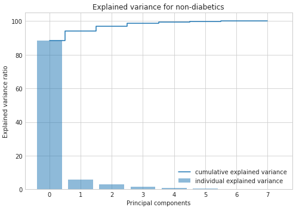
    


    
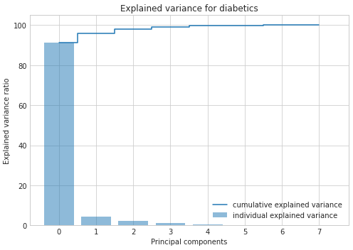
    


We can see with those graphs that, in both groups, the overwhelming majority of the variance can be explained by the first principal component alone (roughly 90% in both cases).
We can also see that the second and third principal components still bear some information but the others can be safely dropped without losing to much information.

Based on these observations, we will reduce the datasets in 2D and maybe try in 3D to see what we can interpret from plotting them:


```python
# Reducing to 2D
P = 2;
_, _, X_diabete0_reduced2D, _ = PCA(X_diabete[0], P)
_, _, X_diabete1_reduced2D, _ = PCA(X_diabete[1], P)
```


```python
# Reducing to 3D
P = 3;
_, _, X_diabete0_reduced3D, _ = PCA(X_diabete[0], P)
_, _, X_diabete1_reduced3D, _ = PCA(X_diabete[1], P)
```

2. Interpret your results. That is, relate the input-feature values to the output values and comment your observations.


```python
# 2D
plt.figure(figsize=(10, 5))

plt.scatter(X_diabete0_reduced2D[:,0], X_diabete0_reduced2D[:,1], label="non-diabetics", s=25 , c="lime", alpha=0.7, linewidths=0.5, edgecolors="black")
plt.scatter(X_diabete1_reduced2D[:,0], X_diabete1_reduced2D[:,1], label="diabetics", s=25, c="red", alpha=0.55, linewidths=0.5, edgecolors="black")

plt.xlabel('Principal Component 0')
plt.ylabel('Principal Component 1')
plt.legend()
plt.tight_layout()
plt.show()
```


    

    


As we can see in this graph, the two groups are clearly separated by the principal component 0, although there is some overlapping.


```python
# 3D
fig = plt.figure(figsize=(10, 10))
ax = fig.add_subplot(111, projection='3d')

ax.scatter(X_diabete0_reduced3D[:,0], X_diabete0_reduced3D[:,2], X_diabete0_reduced3D[:,1], label="non-diabetics", zdir='z', s=25, c="lime", alpha=0.7, linewidths=0.5, edgecolors="black", depthshade=True)
ax.scatter(X_diabete1_reduced3D[:,0], X_diabete1_reduced3D[:,2], X_diabete1_reduced3D[:,1], label="diabetics", zdir='z', s=25, c="red", alpha=0.55, linewidths=0.5, edgecolors="black", depthshade=True)

ax.set_xlabel('Principal Component 0')
ax.set_ylabel('Principal Component 2')
ax.set_zlabel('Principal Component 1')
plt.legend()
plt.tight_layout()
plt.show()
```


    
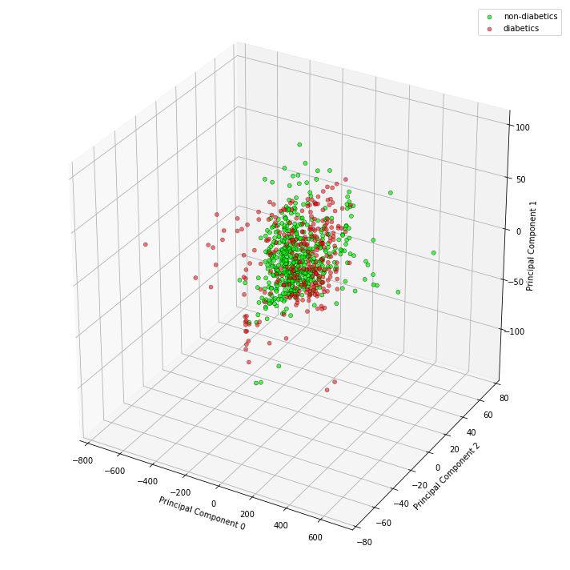
    


The 3D graph is not as obvious.


```python

```
